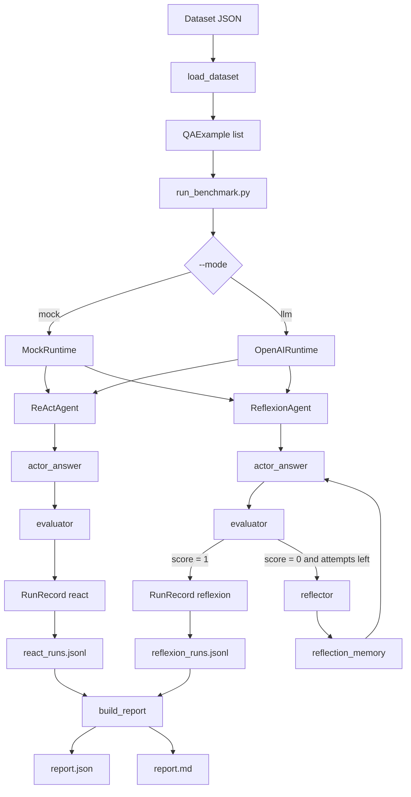

# Version 1

V1 is the first API-backed implementation of the Reflexion Agent lab. It keeps deterministic mock mode for fast testing and adds OpenAI API mode for real model execution.

## Goals

- Keep the original mock benchmark path working.
- Add a clean runtime abstraction so agents do not depend directly on mock or OpenAI code.
- Implement real Actor, Evaluator, and Reflector calls through OpenAI.
- Track token usage and latency from actual LLM calls.
- Provide a safe smoke-test path before running 100 examples.

## Architecture



## Main Files

| File | Purpose |
|---|---|
| `run_benchmark.py` | CLI entrypoint. Selects `mock` or `llm` runtime. |
| `src/reflexion_lab/agents.py` | ReAct and Reflexion loops. |
| `src/reflexion_lab/runtime_base.py` | Shared runtime protocol and `RuntimeCall`. |
| `src/reflexion_lab/mock_runtime.py` | Deterministic offline runtime. |
| `src/reflexion_lab/llm_runtime.py` | OpenAI API runtime. |
| `src/reflexion_lab/prompts.py` | Actor, Evaluator, and Reflector system prompts. |
| `src/reflexion_lab/schemas.py` | Pydantic schemas for examples, traces, reflections, reports. |
| `src/reflexion_lab/reporting.py` | Report generation. |
| `scripts/create_hotpot_sample.py` | Deterministic HotpotQA sampler. |

## Runtime Interface

Both runtimes implement the same methods:

```python
actor_answer(example, attempt_id, agent_type, reflection_memory)
evaluator(example, answer)
reflector(example, attempt_id, answer, judge)
```

Each method returns a `RuntimeCall`:

```python
RuntimeCall(
    value=...,
    token_count=...,
    latency_ms=...,
)
```

This lets the agent loop stay independent from the runtime implementation.

## OpenAI Mode

OpenAI mode uses:

- `ACTOR_SYSTEM` to produce the final short answer.
- `EVALUATOR_SYSTEM` to produce a JSON `JudgeResult`.
- `REFLECTOR_SYSTEM` to produce a JSON `ReflectionEntry`.

Default model:

```text
gpt-4.1-mini
```

Override with either:

```bash
OPENAI_MODEL=gpt-4o-mini
```

or:

```bash
.venv/bin/python run_benchmark.py --mode llm --model gpt-4.1-mini
```

## Commands

Install dependencies:

```bash
.venv/bin/python -m pip install -r requirements.txt
```

Run mock mode:

```bash
.venv/bin/python run_benchmark.py \
  --dataset data/hotpot_mini.json \
  --out-dir outputs/sample_run_v1_mock \
  --mode mock
```

Run LLM smoke test:

```bash
.venv/bin/python run_benchmark.py \
  --dataset data/hotpot_mini.json \
  --out-dir outputs/llm_smoke_1 \
  --mode llm \
  --limit 1
```

Run full LLM benchmark:

```bash
.venv/bin/python run_benchmark.py \
  --dataset data/hotpot_sample_100_seed42.json \
  --out-dir outputs/llm_100_v1 \
  --mode llm
```

## Verification

Completed checks:

```bash
.venv/bin/python -m compileall src run_benchmark.py autograde.py scripts/create_hotpot_sample.py
```

Mock 100 benchmark:

```text
Auto-grade total: 92/100
Flow Score: 72/80
Schema: 30/30
Experiment: 30/30
Analysis: 12/20
Bonus: 20/20
```

LLM smoke test:

```text
Dataset: data/hotpot_mini.json
Mode: llm
Limit: 1
Records: 2
ReAct EM: 1.0
Reflexion EM: 1.0
```

LLM 100 benchmark:

```text
Output: outputs/llm_100_v1/report.json
Dataset: data/hotpot_sample_100_seed42.json
Mode: llm
Records: 200
Autograde total: 92/100
Flow Score: 72/80
Schema: 30/30
Experiment: 30/30
Analysis: 12/20
Bonus: 20/20
```

| Metric | ReAct | Reflexion | Delta |
|---|---:|---:|---:|
| Count | 100 | 100 | 0 |
| EM | 0.64 | 0.83 | +0.19 |
| Avg attempts | 1.00 | 1.54 | +0.54 |
| Avg token estimate | 3029.37 | 5532.34 | +2502.97 |
| Avg latency ms | 3340.44 | 6021.44 | +2681.00 |

Failure mode breakdown:

| Agent | Correct (`none`) | Wrong final answer |
|---|---:|---:|
| ReAct | 64 | 36 |
| Reflexion | 83 | 17 |

Interpretation:

Reflexion improved exact match from 64% to 83%, reducing wrong final answers from 36 to 17. The gain cost about 0.54 extra attempts per question, about 2503 more tokens per question, and about 2.68 seconds more latency per question on average.

## Known Limitations

- Evaluator JSON parsing has a fallback, but V2 should add stricter structured output or retries.
- `failure_modes` are still simple and should be improved for deeper analysis.
- No response caching yet, so repeated LLM runs will call the API again.
- No cost estimate is included in the report yet.

## Recommended V2

- Add retry/backoff around OpenAI calls.
- Add JSON schema constrained output for evaluator and reflector.
- Add response cache keyed by dataset qid, prompt hash, model, and attempt.
- Improve report discussion and failure-mode breakdown from actual traces.
